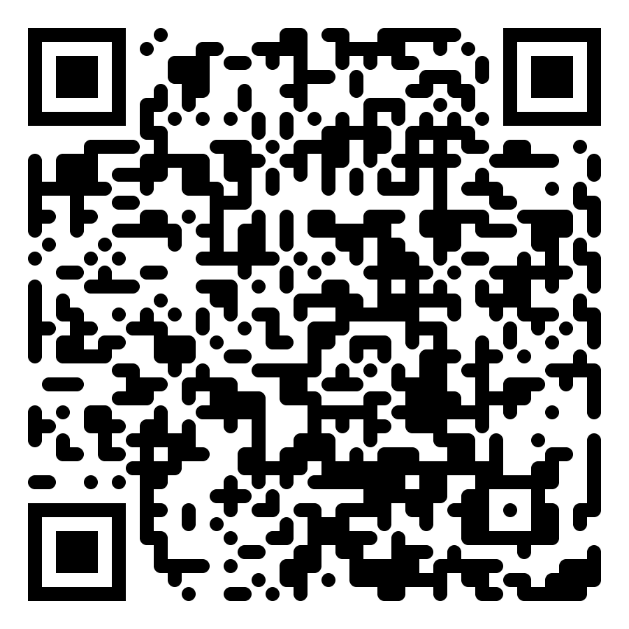

# What if your AI assistants remembered everything you did on your computer?


## How does it work?

```
Periodic screenshots (smart activity based capture)
    → Vision model extracts information about your activity
        → Local storage with vector embeddings (SQLite)
            → MCP server
                → Claude can access information about your activity
```

Everything runs locally - besides the vision model where you can point to any endponit (including local private model).

---

## The hard parts of building this

1. Efficient use of tokens
2. Making the extracted data useful for the user

Other challenges which I won't focus on but happy to discuss in person
- Capturing activity costs CPU (but users like their all day battery life)
- Data privacy guarantees
- Cross platform distribution
- App integrations
- Closing the loop for coding agents (without verification, it produces slop usually, providing verification criteria is tougher for electron apps than for most SW)

---

## Part 1: Token efficiency

### The goal

Extract meaningful information about the users activity.

### The problem

We're processing hundreds of screenshots per hour through vision models - this can get expensive.

We want to provide as **much information** as possible in as **few input tokens** as possible.

Output tokens are quite expensive.

---

### Lessons with Input tokens:

Todo: token per image and per minute of video by model


Understand your models' tokenizers.
Video is incredibly token-efficient representation of "activity" (LLMs usualy sample 1FPS and understand temporal dependencies incredibly well).

---

### Lessons with Output tokens:

Usually cost 3–8x more than input tokens.

Our approach: don't ask the LLM to do what a free API can do. The LLM handles *understanding*. OCR handles *raw recall*.

**High Level:**
LLMs output activity summary - the narrative of what happened at ~$0.0001

**Detail:**
Native OCR extracts text which can be used for perfect recall of the LLM.


## Part 2: Making the data useful

---

# How do you make screen context useful to an LLM?

---

# Three tools, not one

```typescript
search_context(query, startTime?, endTime?, limit?)
// semantic search over activity summaries
// "when did I review that PR?"

browse_timeline(startTime, endTime, limit?, sampling?)
// chronological listing, uniform sampling
// "what did I do this morning?"

get_activity_details(ids[])
// full OCR text, on-demand
// "show me the exact error message"
```

---

# Why three?

LLMs are bad at constructing complex queries.

But they're good at picking the right tool for what you're asking.

```
"find my work on auth module"  →  search_context
"what did I do today?"         →  browse_timeline
"what exactly did it say?"     →  get_activity_details
```

Design tools around how LLMs think, not how your database works.

---

# Live demo

> *"When did I last work on the notarization pipeline?"*

Watch the MCP tool calls in Claude Desktop.

---

# Things we learned building MCP tools

**Tool descriptions are basically prompts** — they matter as much as the implementation behind them.

**Summaries first, details on demand** — keeps responses fast and cheap.

**Add guardrails** — we use anti-overreach rules to prevent over-fetching.

**The happy path should be one tool call** — not three.

---

# The point

MCP tool design is really prompt engineering.

Name your tools clearly. Split by intent, not by data model. Make the common case a single call.

---

# It's open source — scan to star



**[github.com/deusXmachina-dev/memorylane](https://github.com/deusXmachina-dev/memorylane)**

Electron · TypeScript · MCP · SQLite · LanceDB

Works with Claude Desktop, Cursor, and Claude Code today.

---

# Let's connect

🐙 [github.com/FilipKubis](https://github.com/FilipKubis)
🔗 [linkedin.com/in/filip-kubis](https://linkedin.com/in/filip-kubis)

Come chat if you're building MCP tools or local-first AI.
